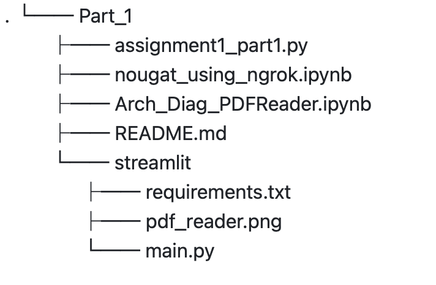

# Text Extraction Tool and Freddie Mac Dataset Quality Assessment App on Streamlit

## Assignment_1

## Summary
The project encompasses the development of two distinct tools.  
 

**Text Extraction Tool** - The first tool helps in summarizing PDF files, particularly from the SEC. Users upload a PDF file onto the streamlit tool, and then choose between two libraries for processing: nougat and pypdf to process and extract.  
https://assignment1-4vyy2ltpzhkmc9lvqkbxht.streamlit.app/  
 
**Freddie Mac Dataset Quality Assessment App** - The second tool aids in the assessment and validation of datasets from Freddie Mac against the specified schema. It integrates great expectations to validate the data against 99 expectations for both Monthly and Origination data then uses pandasprofiling to provide a comprehensive summary of the uploaded dataset. 
https://k4zmnuibfbfjretfv5au69.streamlit.app/ 
 
Both tools will be interactive, web-based applications developed using Streamlit and hosted on Streamlit's public cloud.
 
 
## Architecture

 

## File Structure
Part 1:  

 
Part 2:  

 

 

 

**WE ATTEST THAT WE HAVEN’T USED ANY OTHER STUDENTS’ WORK IN OUR ASSIGNMENT AND ABIDE BY THE POLICIES LISTED IN THE STUDENT HANDBOOK** 

Contribution by each member: 
  ● Anamika Bharali: 33.3% 
  ● Saniya Kapur: 33.3% 
  ● Shruti Suresh Mundargi: 33.3%

